

  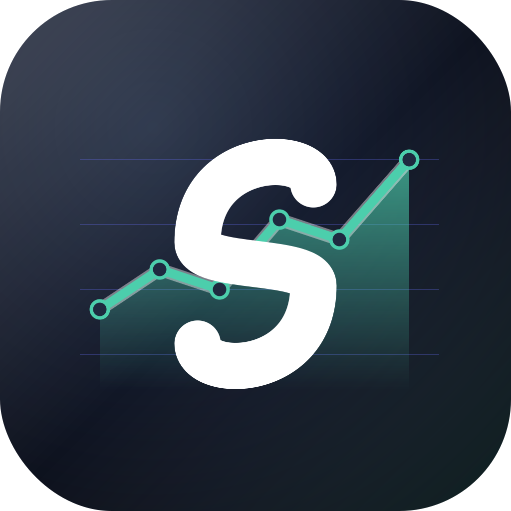

<h1 align="center">Spendium</h1>

  <strong>A private, offline-first expense tracker for Android.</strong> 
  Your data stays on your device and &mdash; if you opt in &mdash; in <em>your own</em> Google
  Drive or OneDrive account. 
  No backend, no analytics, no ads, no account to create.

  <a href="https://play.google.com/store/apps/details?id=com.vshpynta.spendium">
    <strong>Get it on Google Play &rarr;</strong>
  </a>

---

## Why Spendium?

### Your data stays yours
Spendium has **no backend server**. Everything you record lives in an
encrypted on-device SQLite database. We literally cannot see your
expenses — there is nowhere for them to go.

### Works fully offline
Open Spendium on the subway, on a flight, in the middle of nowhere — it
just works. Every screen reads from local storage, every entry is saved
locally first. The internet is optional.

### Automatic multi-device sync, on *your* cloud
Want to use Spendium on your phone *and* your tablet? Sign in to
**Google Drive** or **OneDrive** and Spendium will keep both devices in
sync through a single hidden file in your own cloud account
(`appDataFolder` / `approot` scope only — Spendium cannot see any of
your other files).

Sync runs automatically in the background: on app start, when you bring
the app to the foreground, after each edit, and when the network comes
back online. There is also a "Sync now" button if you ever want to force it.

### Privacy first
- **No tracking SDKs.** Not Firebase Analytics, not Sentry, not Mixpanel — none.
- **No ads.** Never.
- **No accounts.** Spendium does not have its own login system.
- **Only `INTERNET` permission.** Used solely to talk to OAuth and the
  public exchange-rate service when you actually need them.
- **Open source.** Audit the code yourself.

### Powerful spending analysis
Three complementary views into your money:

- **Categories** — donut chart and per-category totals for any period.
- **Transactions** — flat or date-grouped list with full-text search and
  category filtering.
- **Overview** — per-day sparkline plus a stacked / line breakdown by
  category, with an interactive tooltip showing exact amounts.

Choose any period: today, week, month, year, all-time, or a custom range.

### Multi-currency with historical FX
Record expenses in *any* currency. Spendium fetches **historical**
exchange rates from the open [frankfurter.dev](https://frankfurter.dev)
service and converts everything into your chosen display currency using
the rate that was actually in effect on the day of each transaction —
not today's rate.

### Available in 15 languages
English, German, Spanish, French, Italian, Polish, Portuguese, Russian,
Slovak, Czech, Turkish, Ukrainian, Chinese (Simplified), Hindi, and
Vietnamese. The locale follows your phone's language setting by default
and can be overridden in Settings.

### Light, dark, and adjustable font size
Material 3 light and dark themes that follow your system setting, plus
four font-size presets for accessibility.

### Custom categories with icons
Use the seeded default categories or create your own — pick an icon, pick
a name, you're done.

### Quick entry with built-in calculator
Add an expense in three taps: amount → category → done. The number pad
doubles as a calculator (`+`, `−`, `×`, `÷`) so you can split a receipt
on the spot without leaving the app.

### Backup & restore
Export everything to a lossless JSON file or a CSV (great for spreadsheets)
straight from Settings. Restore on another device in one tap.

---

## Screenshots

### See where your money goes

<table style="width:100%; table-layout:fixed;">
  <tr>
    <td align="center" width="33%" valign="top">
      <a class="zoom" href="./assets/screenshots/01-categories-light.jpg" title="Click to enlarge">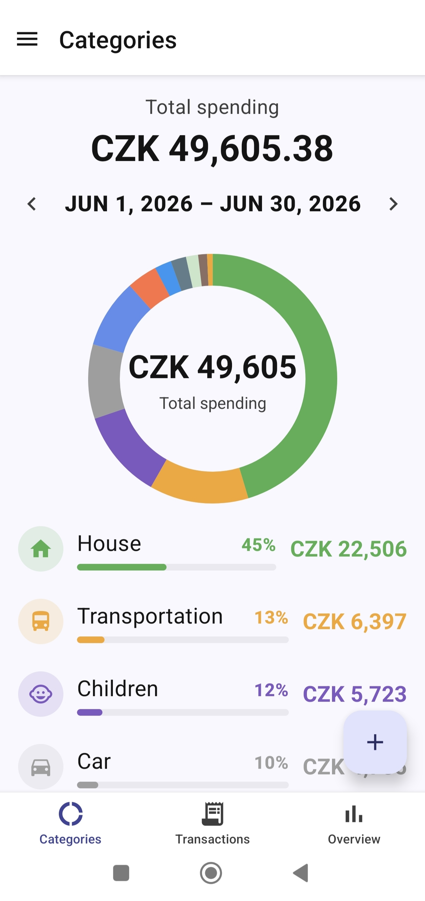</a>
       <strong>Categories</strong> &mdash; donut + per-category breakdown
    </td>
    <td align="center" width="33%" valign="top">
      <a class="zoom" href="./assets/screenshots/02-overview-stacked-light.jpg" title="Click to enlarge">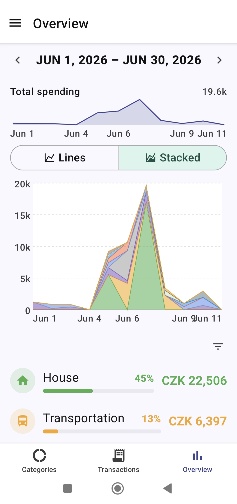</a>
       <strong>Overview</strong> &mdash; stacked area by category
    </td>
    <td align="center" width="33%" valign="top">
      <a class="zoom" href="./assets/screenshots/03-overview-lines-light.jpg" title="Click to enlarge">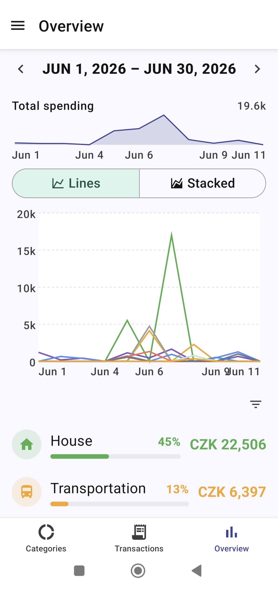</a>
       <strong>Lines view</strong> &mdash; per-category over time
    </td>
  </tr>
</table>

### Drill down with interactive charts (dark mode)

<table style="width:100%; table-layout:fixed;">
  <tr>
    <td align="center" width="33%" valign="top">
      <a class="zoom" href="./assets/screenshots/06-categories-dark.jpg" title="Click to enlarge">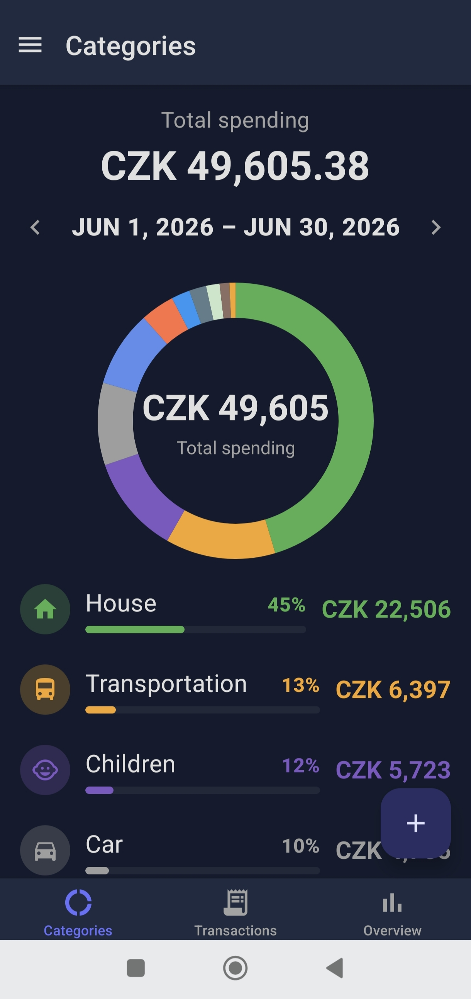</a>
       <strong>Categories</strong> &mdash; dark theme
    </td>
    <td align="center" width="33%" valign="top">
      <a class="zoom" href="./assets/screenshots/05-overview-stacked-dark.jpg" title="Click to enlarge">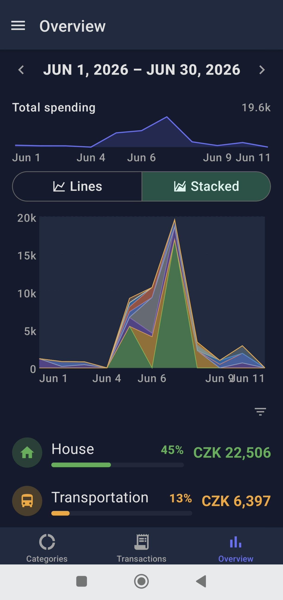</a>
       <strong>Stacked area</strong> &mdash; dark theme
    </td>
    <td align="center" width="33%" valign="top">
      <a class="zoom" href="./assets/screenshots/04-overview-tooltip-dark.jpg" title="Click to enlarge">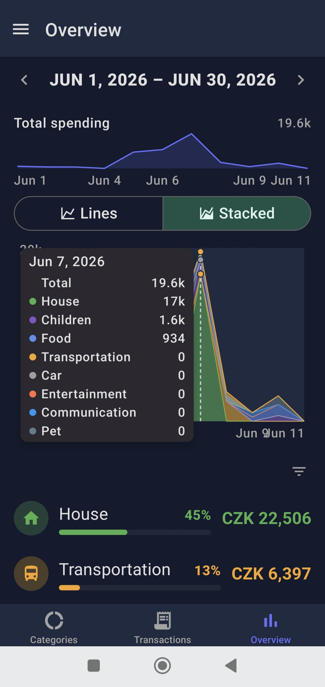</a>
       <strong>Interactive tooltip</strong> &mdash; exact amounts on tap
    </td>
  </tr>
</table>

### Browse, search & filter every transaction

<table style="width:100%; table-layout:fixed;">
  <tr>
    <td align="center" width="33%" valign="top">
      <a class="zoom" href="./assets/screenshots/07-transactions-multicurrency-dark.jpg" title="Click to enlarge">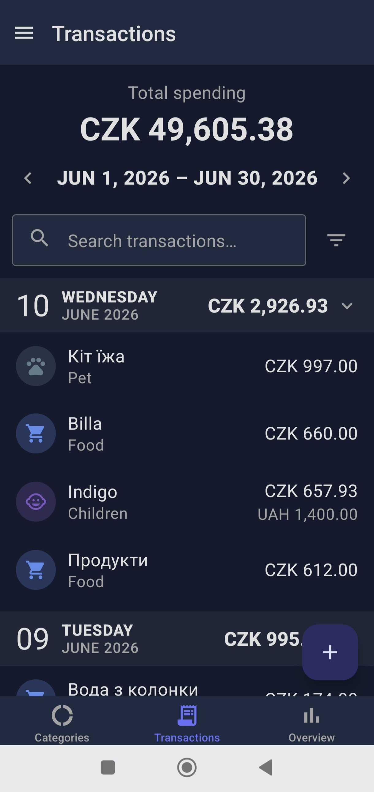</a>
       <strong>Multi-currency</strong> &mdash; historical FX conversion
    </td>
    <td align="center" width="33%" valign="top">
      <a class="zoom" href="./assets/screenshots/08-transactions-search-filter-dark.jpg" title="Click to enlarge">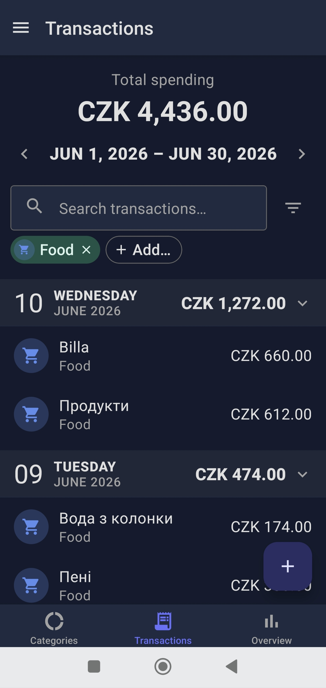</a>
       <strong>Search &amp; filter</strong> &mdash; by text and by category
    </td>
    <td align="center" width="33%" valign="top">
      <a class="zoom" href="./assets/screenshots/11-period-picker-dark.jpg" title="Click to enlarge">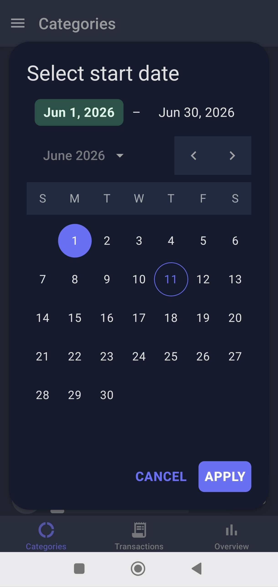</a>
       <strong>Any time period</strong> &mdash; day, week, month, year, range
    </td>
  </tr>
</table>

### Add, edit, sync &mdash; or keep it 100% local

<table style="width:100%; table-layout:fixed;">
  <tr>
    <td align="center" width="25%" valign="top">
      <a class="zoom" href="./assets/screenshots/09-quick-add-calculator-light.jpg" title="Click to enlarge">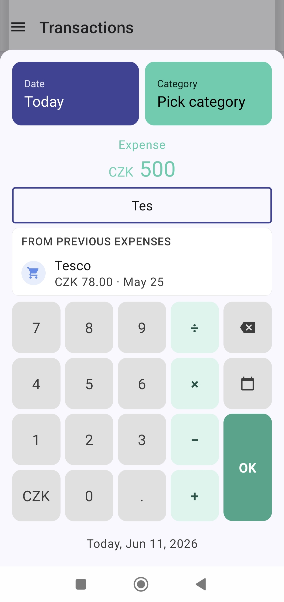</a>
       <strong>Quick add</strong> &mdash; merchant autocomplete + calculator keypad
    </td>
    <td align="center" width="25%" valign="top">
      <a class="zoom" href="./assets/screenshots/10-edit-expense-dark.jpg" title="Click to enlarge">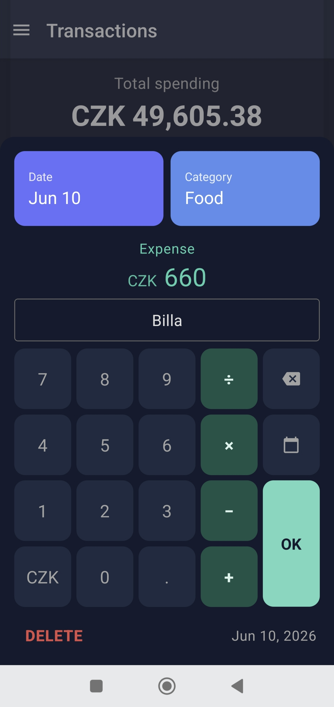</a>
       <strong>Edit &amp; delete</strong> &mdash; tap any transaction to change it
    </td>
    <td align="center" width="25%" valign="top">
      <a class="zoom" href="./assets/screenshots/12-cloud-sync-dark.jpg" title="Click to enlarge">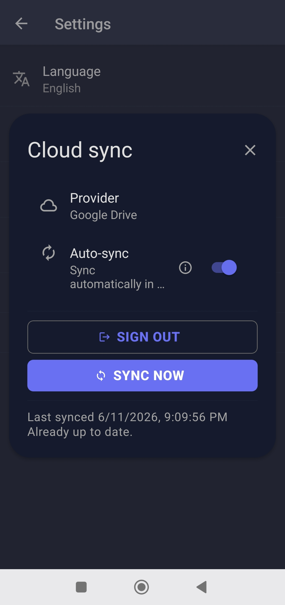</a>
       <strong>Cloud sync</strong> &mdash; Google Drive or OneDrive, your account, your file
    </td>
    <td align="center" width="25%" valign="top">
      <a class="zoom" href="./assets/screenshots/13-export-import-dark.jpg" title="Click to enlarge">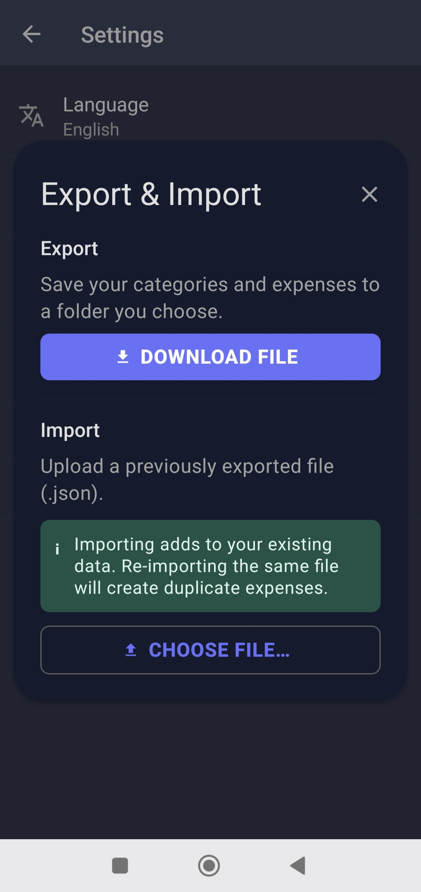</a>
       <strong>Backup &amp; restore</strong> &mdash; lossless JSON or CSV-in-ZIP
    </td>
  </tr>
</table>

---

## Get Spendium

  <a href="https://play.google.com/store/apps/details?id=com.vshpynta.spendium">
    <strong>Google Play &mdash; Spendium</strong>
  </a>

---

## Links

- [Privacy Policy](./privacy.md)
- [Source code on GitHub](https://github.com/VolodymyrShpynta/expenses-tracker-playground/tree/main/expenses-tracker-mobile)

## Contact

Questions, bug reports, or feature ideas:
[volodymyr.shpynta.n@gmail.com](mailto:volodymyr.shpynta.n@gmail.com)

<!-- ===== Lightbox for screenshot zoom =====
     Clicking any <a class="zoom"> opens its href image in a centered overlay.
     If JavaScript is disabled, the link simply opens the full-size image in
     a new tab (default <a> behavior). -->

  <button id="lightbox-close" aria-label="Close preview">&times;</button>
  

